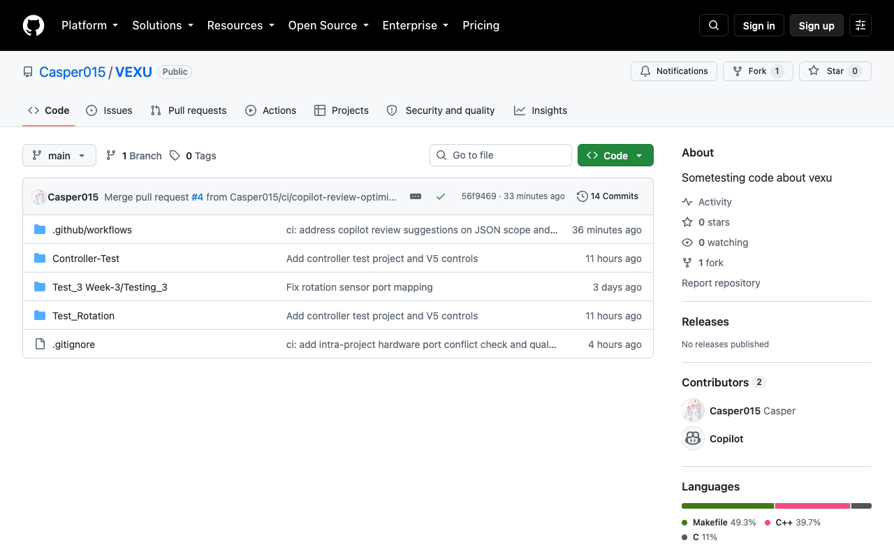
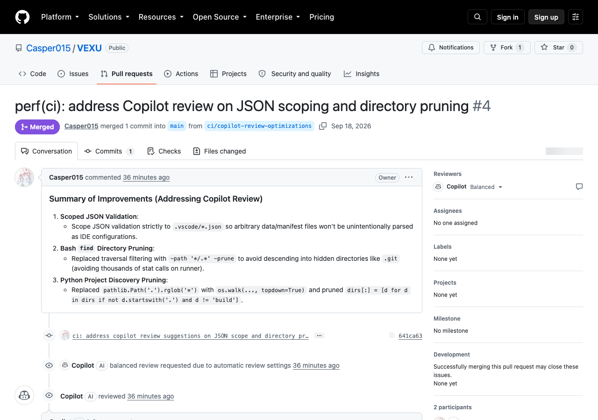
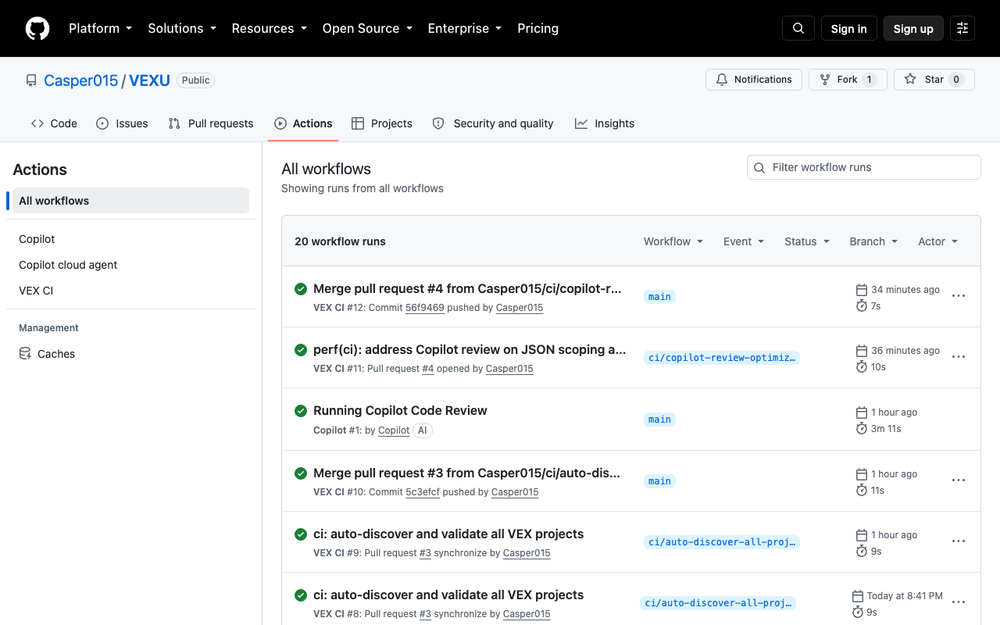

# Mt. SAC VEX U — Test & Prototyping Codebase (`VEXU`)

[](https://github.com/Casper015/VEXU/actions/workflows/ci.yml)

Welcome to the **Mt. SAC VEX U 2026–2027** testing and prototyping repository.  
This codebase hosts active subsystem proof-of-concepts, controller mappings, sensor telemetry experiments, and engineering notebook meeting logs.

---

## 📂 Repository Architecture

| Directory | Subsystem / Focus | Description |
|---|---|---|
| **`0_Basic-Test/`** | Integrated Prototype | Baseline drive and sensor testing for early prototype iterations. |
| **`1_Test-Rotation/`** | Sensor Telemetry | V5 Rotation Sensor and Inertial Sensor closed-loop feedback and heading calibration. |
| **`2_Controller-Test/`** | Operator Interface | Joystick driving algorithms, button-hold polling loops, and auxiliary motor triggers (Arm / Claw). |
| **`NoteBook/`** | Engineering Notebook | Meeting logs, root-cause setback analyses (Problems & Solutions), and technical evidence. |

*(Note: VEX Makefiles require project directory names to contain **no whitespace**).*

---

## 🤝 Contribution & Collaboration Guide (Fork Required)

> [!IMPORTANT]
> **Branch Protection is Active on `main`**: Direct pushes to `main` are strictly forbidden.  
> To contribute code, bug fixes, or new mechanism projects, you **must fork this repository first** and submit your changes through a **Pull Request (PR)**.

```
[Upstream: Casper015/VEXU] 
       │ 1. Click 'Fork'
       ▼
[Your Personal GitHub Fork] 
       │ 2. git clone & git checkout -b feat/your-feature
       ▼
[Local Development & Dry-run Build (make -n all)]
       │ 3. git commit & git push origin feat/your-feature
       ▼
[Your Fork Branch on GitHub]
       │ 4. Open Pull Request (PR) -> Casper015/VEXU:main
       ▼
[GitHub Actions Automated CI & Copilot Code Review]
       │ 5. All checks pass (Green light)
       ▼
[Merged into Casper015/VEXU:main]
```

---

### Step-by-Step Instructions

#### 1. Fork the Repository
Click the **`Fork`** button located at the top-right corner of the [Casper015/VEXU](https://github.com/Casper015/VEXU) repository page to create a personal copy under your GitHub account.



#### 2. Clone Your Fork Locally & Create a Feature Branch
Clone your personal fork to your workstation, navigate into the repository, and create a descriptive feature branch:

```bash
# Clone your personal fork
git clone https://github.com/<YOUR_GITHUB_USERNAME>/VEXU.git
cd VEXU

# Create and checkout a new branch (do NOT work directly on main)
git checkout -b feat/arcade-drive-deadband
```

#### 3. Develop, Code & Test Locally
Work on your mechanism or test project. Before committing, verify the Makefile dependency rules by performing a dry-run build:

```bash
cd 2_Controller-Test   # Navigate to your project directory
make -n all            # Dry-run build: verify Makefile syntax and source includes
```

#### 4. Commit & Push to Your Fork
Stage your changes, write a clean conventional commit message, and push the branch to your fork:

```bash
git add .
git commit -m "feat(chassis): add joystick deadband filtering to arcade drive"
git push -u origin feat/arcade-drive-deadband
```

#### 5. Open a Pull Request (PR)
Go to your fork on GitHub and click **`Compare & pull request`**. Set the base repository to `Casper015/VEXU` and base branch to `main`. Fill in the PR summary describing what changes were made and how they were tested.



---

## 🛡️ Automated CI/CD Quality Gates

Every Pull Request targeting `main` must pass our comprehensive automated verification pipeline before it can be merged:



| CI Check Gate | Scope & What It Verifies |
|---|---|
| **Multi-Project Auto-Discovery** | Dynamically discovers all directories containing a `makefile`. Validates required structure (`src/`, `include/`, `vex/mkenv.mk`, `vex/mkrules.mk`) and runs `make -C <project> -n all`. |
| **Intra-Project Port Conflict Guard** | Scans all C++ files **within each individual project folder** to ensure no two motors/sensors share the same V5 Smart Port (`PORT1`–`PORT21`). Different projects can independently reuse ports. |
| **Git Hygiene & File Safety** | Prevents accidental check-ins of compiled binaries (`.bin`, `.elf`, `.o`, `.a`), OS metadata (`.DS_Store`), or oversized files (> 5MB). |
| **Privacy & Local Path Leak Guard** | Flags any hardcoded developer machine paths (such as `/Users/...` or `C:\Users\...`) to maintain repository privacy. |
| **JSON Configuration Validation** | Validates syntax integrity of all `.vscode/*.json` configuration files across all projects. |
| **GitHub Copilot Automated Review** | Repository Ruleset automatically triggers AI code reviews on incoming PR commits. |

---

## 🛠️ Development Requirements

- **IDE**: [VS Code](https://code.visualstudio.com/) with the official **VEX Extension**, or **VEXcode Pro V5**.
- **Compiler**: ARM Embedded GCC Toolchain (`arm-none-eabi-gcc`).
- **Build System**: GNU Make.

---

## 📄 License & Team Standards
This repository is maintained by **Mt. SAC VEX U Robotics Team**.  
All rights reserved for competitive team use. Code is strictly validated for the 2026–2027 season.
